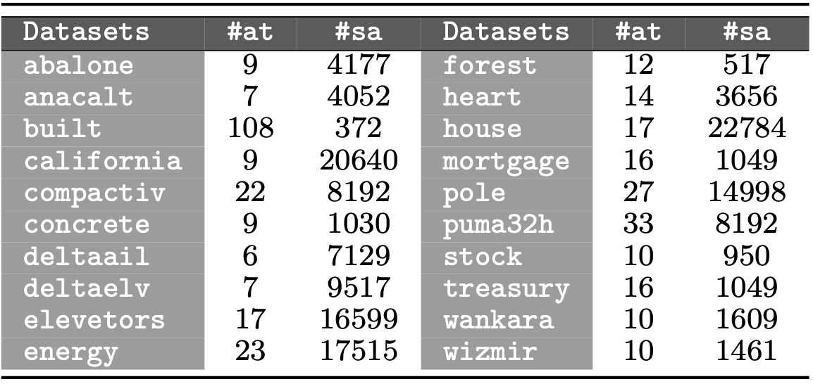

 

This web-page contains complementary material to the research paper:

| | |
|:---|:---|
||Juan Martín, José A. Sáez, Emilio Corchado. **Analyzing the problem of noisy data in regression datasets: a novel comprehensive scheme to adapt noise filters from the classification field**. [Information Sciences](https://www.journals.elsevier.com/information-sciences), 2020 (submitted).|
| | |

 

The web is organized according to the following summary:

1. [Abstract](#Abstract)
2. [Real-world datasets](#Datasets)
3. [Performance results](#Performance)

 
 
##  1. Abstract
Real-world datasets usually contain noise, which can affect both classification and regression problems. In order to address errors in the data, noise filters are used to remove noisy samples from the training dataset. Even though numerous noise filtering methods are available for classification problems, the opposite occurs in the regression field. Therefore, this research proposes a novel comprehensive scheme to adapt the most relevant classification noise filters to regression problems with the main aim of checking if these techniques help to reduce the negative impacts of noise in regression data. A dozen of new regression noise filtering methods based on existing classification noise filters are built and used to preprocess datasets in which different noise levels are injected in a controlled way. The results obtained show that all the novel noise filters improve the performance of several regression algorithms belonging to different paradigms with respect to not preprocessing the data. This fact shows the great capacity of the new noise filters presented in this study to address the noisy data problem in the regression field.

 
 
##  2. Real-world datasets
This research considers 20 different regression datasets taken from the *UCI machine learning* and *KEEL-dataset* repositories. Different noise levels (ranging from x = 5% to x = 30%, by increments of 5%) are introduced into them. These datasets are shown in the following figure, along with the number of attributes (#at) and samples (#sa) for each one.

These datasets can be downloaded from the web-pages:

[https://archive.ics.uci.edu/ml/datasets.php](https://archive.ics.uci.edu/)

[http://www.keel.es/](http://www.keel.es/)

 

##  3. Performance results

|||
|:---|:---:|
|&nbsp;&nbsp;&nbsp;**-** *RMSE results of RPART using regression noise filters.* | |
|&nbsp;&nbsp;&nbsp;**-** *RMSE results of NN using regression noise filters.* | |
|&nbsp;&nbsp;&nbsp;**-** *RMSE results of SVM using regression noise filters.* | |
|&nbsp;&nbsp;&nbsp;**-** *RMSE results of ELM using regression noise filters.* | |
|&nbsp;&nbsp;&nbsp;**-** *RMSE results of XGBoost using regression noise filters.* | |
|||
